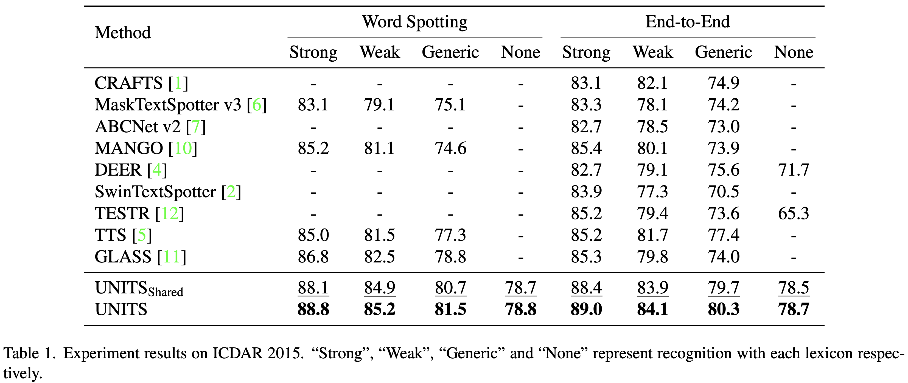
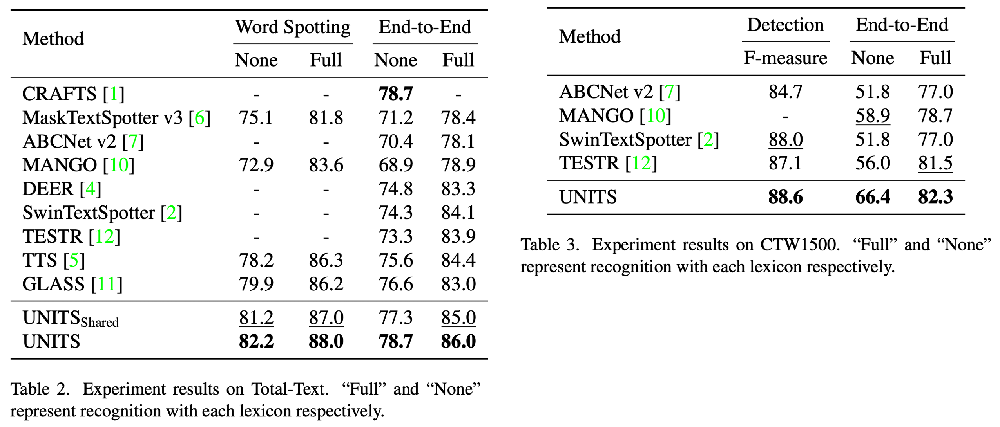
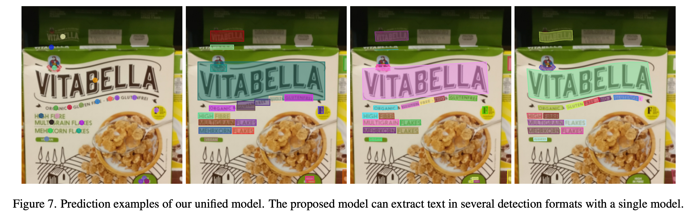

# UNITS

This is a official implementation of the following paper

> [**Towards Unified Scene Text Spotting based on Sequence Generation**](https://arxiv.org/abs/2304.03435), CVPR 2023. <br>
> Taeho Kil, Seonghyeon Kim, Sukmin Seo, Yoonsik Kim, Daehee Kim<br>

[](https://openaccess.thecvf.com/content/CVPR2023/html/Kil_Towards_Unified_Scene_Text_Spotting_Based_on_Sequence_Generation_CVPR_2023_paper.html)
[](https://arxiv.org/abs/2304.03435)


## Introduction

Sequence generation models have recently made significant progress in unifying various vision tasks. Although some auto-regressive models have demonstrated promising results in end-to-end text spotting, they use specific detection formats while ignoring various text shapes and are limited in the maximum number of text instances that can be detected. To overcome these limitations, we propose a UNIfied scene Text Spotter, called UNITS. Our model unifies various detection formats, including quadrilaterals and polygons, allowing it to detect text in arbitrary shapes. Additionally, we apply starting-point prompting to enable the model to extract texts from an arbitrary starting point, thereby extracting more texts beyond the number of instances it was trained on. Experimental results demonstrate that our method achieves competitive performance compared to state-of-the-art methods. Further analysis shows that UNITS can extract a larger number of texts than it was trained on.


## Updates

**_2023-07-17_** First Commit, We release our code, data annotations, and model weights.


## Getting Started

### Installation

Our model implementation is based on [timm](https://github.com/huggingface/pytorch-image-models/blob/main/timm/layers/drop.py#L157).

To begin, please install the necessary dependencies by running the following command:

```bash
pip install -r requirements.txt
```

### Preparing Datasets

#### LMDB

Before proceeding, make sure to download the following datasets according to the instructions provided by AdelaiDet: [README.md](https://github.com/aim-uofa/AdelaiDet/blob/master/datasets/README.md). The datasets you need to download are TotalText, CTW1500, ICDAR2013, ICDAR2015, and CurvedSynText150k.

Additionally, download the MLT2019, TextOCR, and HierText datasets from the following sources: [MLT2019](https://rrc.cvc.uab.es/?ch=15), [TextOCR](https://textvqa.org/textocr/dataset), [HierText](https://github.com/google-research-datasets/hiertext).

Furthermore, ensure that all dataset annotations are converted to the lmdb format. We have provided the source code to convert the annotations from their original format to the lmdb format used in UNITS. Execute the following commands:

```bash
python script make_lmdb.py --split train
python script make_lmdb.py --split val
python script make_lmdb.py --split test
```

Additionally, you can download the converted lmdb files from the following path: [lmdb](https://drive.google.com/drive/folders/1eXIG-gCNpDhm7v4z5jZ5rg7kWvZEOh1l?usp=sharing).


#### Structure

This repository assumes the following structure for the datasets:

```bash
train_datasets
├── images
│   ├── hiertext
│   ├── textocr
│   ├── synthtext150k
│   ├── ctw1500
│   ├── totaltext
│   ├── icdar13
│   ├── icdar15
│   ├── mlt19
│
│
├── hiertext_train.lmdb
├── textocr_train.lmdb
├── synthtext150k.poly.part1_train.lmdb
├── ctw1500.poly_test.lmdb
              .
              .
```


- Each lmdb file contains OCR annotation information and relative paths to the corresponding image filenames.
- All images are stored in the "images" directory, with different directories depending on the dataset name.
- For more detailed information about this structure, refer to the script/make_lmdb.py file. This source code provides the necessary functionality to modify the names or structure of the relative paths as needed.

### Demo

You can visualize the network's predictions by running the following command:

```bash
PYTHONPATH=$PWD python script/demo.py --conf configs/finetune.py \
                                      --ckpt weights/shared.pt
```

You can also adjust the DETECT_TYPE parameter to modify the detection format for predictions.

### Training

#### Checkpoints
[pretrain](https://drive.google.com/file/d/1iKM4udLcirog3bbviHGcPDo51HMF6RhA/view?usp=sharing)  
[shared](https://drive.google.com/file/d/1XEBRaEBp3IRnd1P3lkfpVbBIQZIThMF0/view?usp=sharing)  
[ic15](https://drive.google.com/file/d/1c76n9QvysA30q31KMzrDoa7I9bqLuBSa/view?usp=sharing)  
[totaltext](https://drive.google.com/file/d/1g_LoKYqepQNSKPwR3ygzdLJhk-KRMoez/view?usp=sharing)  
[ctw](https://drive.google.com/file/d/1D42rZo4HJBp6wTikkOvcHCAAM8EKaWWk/view?usp=sharing)  
[textocr](https://drive.google.com/file/d/1TWZc_uLLBCzV2evrxZBdaN4HI_8eGtMK/view?usp=sharing)  

#### Examples
Here are the pre-training and fine-tuning configurations used in our experiments. The following commands demonstrate the experiment setup for 8 GPUs with A100 (80GB) memory.

```bash
# pre-train
PYTHONPATH=$PWD python script/train.py --conf configs/pretrain.py \
                                       --n_proc 8
```

```bash
# unified finetune
PYTHONPATH=$PWD python script/train.py --conf configs/finetune.py \
                                       --ckpt weights/pretrain.pt \
                                       --n_proc 8
```

```bash
# ic15 finetune
PYTHONPATH=$PWD python script/train.py --conf configs/ic15.py \
                                       --ckpt weights/shared.pt \
                                       --n_proc 8
```

In addition to ICDAR2015, fine-tuning config files for TotalText, CTW1500, and TextOCR dataset have also been uploaded.

### Evaluation

Our implementation is based on [AdelaiDet](https://github.com/aim-uofa/AdelaiDet).

To evaluate on TotalText, CTW1500, ICDAR2015, TextOCR first download the [gt.tar](https://drive.google.com/file/d/1R1wIOcK9vYs_Z-_mK3juWIgkuElI7kMA/view?usp=sharing) and [vocab.tar](https://drive.google.com/file/d/1TucABbNvzTT7Bc1FmpYg9od4RcjJJ6RT/view?usp=sharing)

```bash
cd evaluation/datasets
mkdir evaluation
tar -xvf gt.tar
tar -xvf vocab.tar
```

The evaluation process consists of three steps:

1. Saving the prediction results as TXT files for each dataset.

   Here is an example of extracting results for IC15:

   ```bash
   PYTHONPATH=$PWD python script/test.py --conf configs/ic15.py \
                                         --ckpt weights/shared.pt
   ```

2. Combining the TXT files into a single JSON file.

   Here is an example of extracting results for IC15:

   ```bash
   mv res_output evaluation/ic15_res
   cd evaluation
   cd ic15_res
   python refine.py --inputs res_output \
                    --outputs shared.json \
                    --num_pts 4
   ```

3. Calculating performance evaluation metrics for the converted JSON predictions.

   Here is an example of evaluating the performance of IC15 using weak vocabulary:

   ```bash
   cd evaluation
   python contextualizer.py --output ic15_res/shared.json \
                            --eval_db icdar2015 \
                            --weak
   ```

In addition to ICDAR2015, performance evaluation codes and `gt.zip` files for TotalText, CTW1500, and TextOCR have also been uploaded.


## Experimental Results

<div align="center">




<br />
<br />




</div>


## How to Cite

```
@inproceedings{kil2023towards,
  title={Towards Unified Scene Text Spotting based on Sequence Generation},
  author={Kil, Taeho and Kim, Seonghyeon and Seo, Sukmin and Kim, Yoonsik and Kim, Daehee},
  booktitle={Proceedings of the IEEE/CVF Conference on Computer Vision and Pattern Recognition},
  pages={15223--15232},
  year={2023}
}
```


## License

```
UNITS
Copyright (c) 2023-present NAVER Cloud Corp.

Licensed under the Apache License, Version 2.0 (the "License");
you may not use this file except in compliance with the License.
You may obtain a copy of the License at

    http://www.apache.org/licenses/LICENSE-2.0

Unless required by applicable law or agreed to in writing, software
distributed under the License is distributed on an "AS IS" BASIS,
WITHOUT WARRANTIES OR CONDITIONS OF ANY KIND, either express or implied.
See the License for the specific language governing permissions and
limitations under the License.
```
